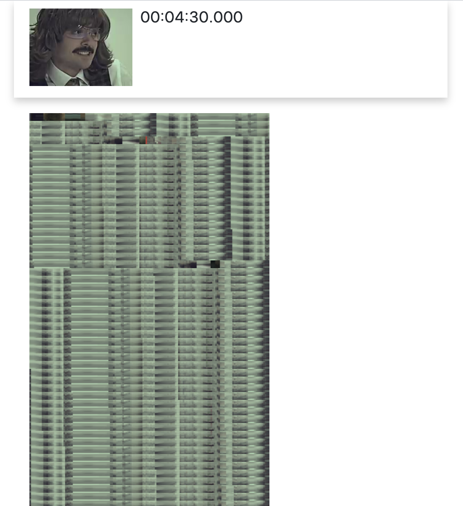

# Video easter eggs

<!-- [](https://github.com/kachkaev/video-easter-eggs/actions?query=workflow%3AChecks) -->

[video-easter-eggs.now.sh](https://video-easter-eggs.now.sh)

> ⚠️ ⚠️ ⚠️ Work in progress ⚠️ ⚠️ ⚠️

🔎 A visual analytics tool to find easter eggs in videos.
Inspired by https://www.youtube.com/watch?v=6g82FwQfpGc



## Features

Keyboard shortcuts

- **← →** jump 1 frame (or 10 seconds with **shift**)
- **↓↑** jump 1 segment (or 5 segments with **shift**)
- **Enter** open video at current time in new tab

## Working locally

1.  Clone the repo

1.  Install dependencies

    ```sh
    yarn install
    ```

1.  Run the probe command to detect missing software

    ```sh
    yarn exe:dev src/commands/prope.ts
    ```

### Processing a video

1.  Copy `.env.dist` to `.env`, specify custom `VIDEO_ID` (e.g. `myTestVideo`).

1.  Create `var/videos/myTestVideo/config.yml`:

    ```yml
    url: https://www.youtube.com/watch?v=??
    shortTitle: ??
    frameSamplingInterval: 500
    framePreviewHeight: 144
    frameStripeHeight: 10
    tailCutoffDuration: 1000
    ```

1.  Run commands:

    ```sh
    yarn exe:dev src/commands/videoProcessing/1-download.ts
    yarn exe:dev src/commands/videoProcessing/2-extractFramePreviews.ts
    yarn exe:dev src/commands/videoProcessing/3-extractFrameStripes.ts
    yarn exe:dev src/commands/videoProcessing/4-joinFrameStripes.ts
    ```

### Running a local server

1.  Start the server

    ```
    yarn dev
    ```

1.  Navigate to your video page, e.g.:

    ```
    http://localhost:3000/myTestVideo
    ```

### Deployment

1.  Upload video-related resources to s3

    ```
    yarn exe:dev src/commands/s3/uploadVideoRelatedResources.ts
    ```

## TODO

- index page + API route to get all video infos

- segments

  - implement automatic splitting of video into segments
  - display segments from videoInfo in the UI

- easter eggs

  - show the list of annotated segments

- UI
  - virtualize list
